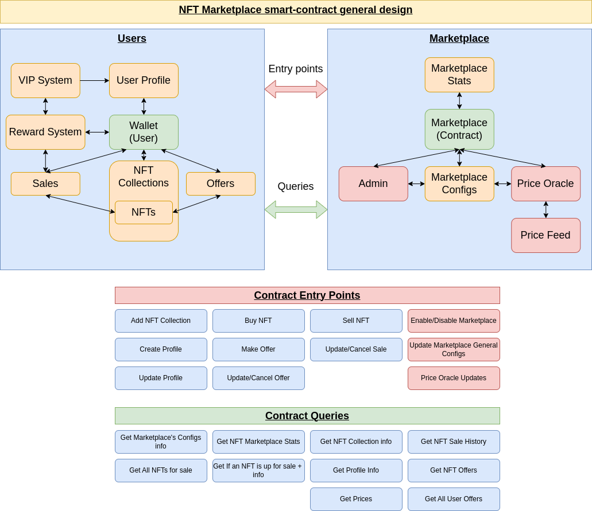

# Design details about the Marketplace smart-contract

In the below image, you can find a high-level overview of how the smart-contract will be designed. 

## Users
When a user trades NFTs on the marketplace, he/she will be part of the *reward system* (more information later). This *reward system* will grant different type of perks related to the marketplace. 

### On-chain profile
A user on a blockchain is uniquely identified by a wallet address. Also, when a unique user interacts with the NFT marketplace, the user will be given a **on-chain profile** where he/she can modify the following:
- Social links
- Description
- NFT showcase
- NFT Profile picture
- NFT Background picture
- Statistics about the user/profile 
- VIP system (more info soon)

The on-chain profile will be accessible via the marketplace website/application and it will be public and can be easily shared on other social media platforms. We are also discussing additional features about the profile which we'll make public later on. You can update your profile whenever you want.

### Sales & Offers
Users will be able to sell and also make offers on any NFTs. The users only have to specify the following information when making those:
- Price: it can be in $HUAHUA or any other IBC-enabloed denominations like $ATOM, $JUNO, $LUNA, $LUNC, etc.
- Expiration: user can set an expiration to their sale and offers
- Update and or cancel at any time

### Reward System
The more volume you have on the marketplace, the more rewards you will get. These rewards will be used to improve your profile and will grant the users with additional perks on the marketplace. We will be providing more info about the Reward and VIP systems later on.

### Adding new collections
As the marketplace is permissionless, users can add any collection on the marketplace

## Marketplace
Only the admin can change general configs about the marketplace. The most common configurations are marketplace fees.

### Statistics
For every transactions happening on the marketplace, statistics will be logged on-chain and will be publicly available. The statistics that we will be displaying are:  
**For the marketplace**:  
- Total volume
- Revenues
- Number of trades
- Etc.

**For an NFT collection**:  
- Current floor
- Volume
- NFTs for sale
- Number of trades
- Etc.

**For a given NFT**:  
- Trade history
- Current offers
- If it is for sale: price and expiration
- Etc.

### Configurations
The configurations are just a set of publicly available information that defines the marketplace. Only the admin can change these configs. The configurations are:
- NFT collection currently on the marketplace
- Marketplace fees
- Denominations accepted
- The status of the marketplace: enabled or disabled 

### Price Oracle
As it will be possible to trade NFTs using different IBC assets/native assets, we need a price oracle to coordinate and standardise the values. 

## Summary
In the below image, you can see how the interactions will happen. An **entry point** is an interaction any user on a blockchain can do with the marketplace. **Queries** are public information that can be accessed by anyone using on-chain queries.

**Note**: If you have any comments and think some of the presented information should be changed, please feel free to contact us so we can discuss.

